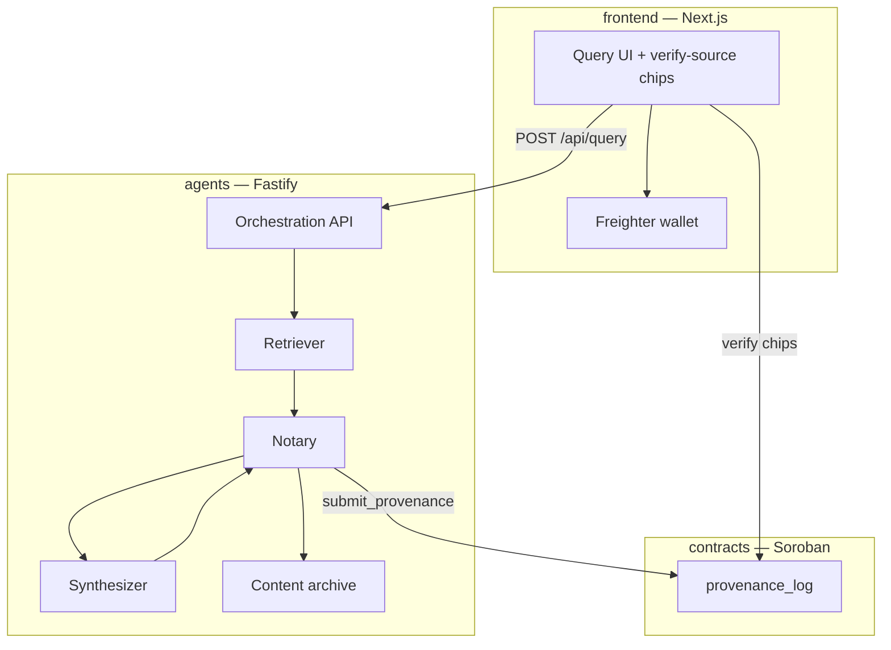
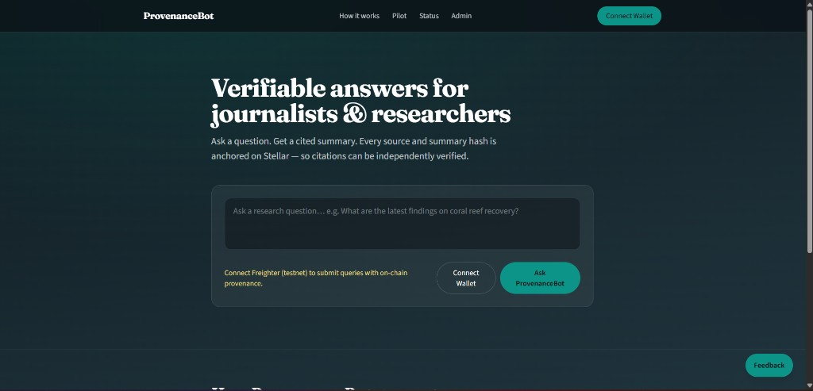
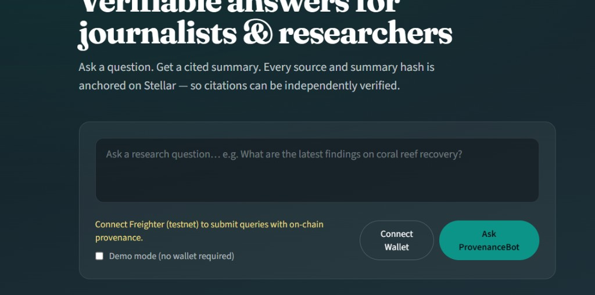
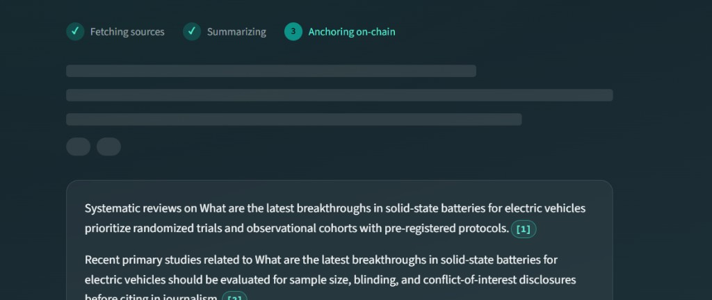
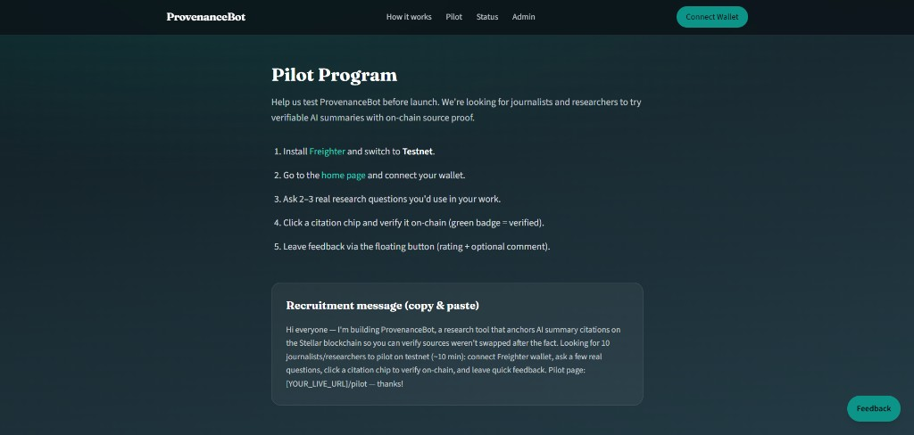
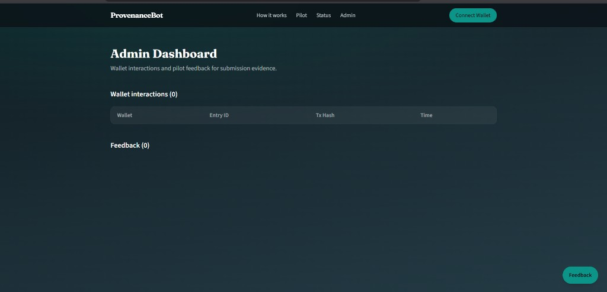
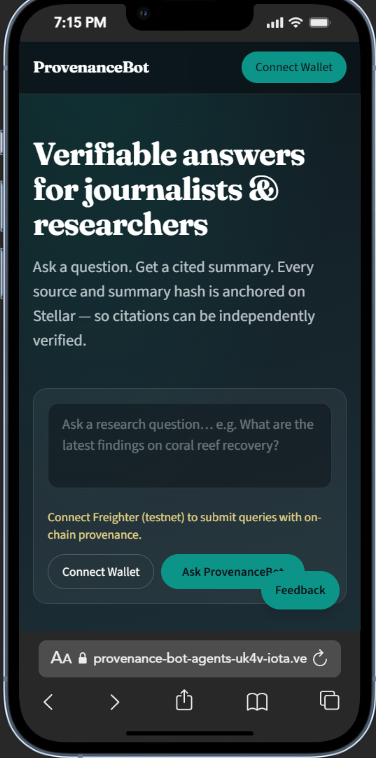
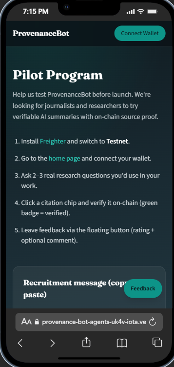

# ProvenanceBot

Verifiable content-sourcing agent on **Stellar/Soroban**. ProvenanceBot retrieves sources for a query, synthesizes a grounded summary, and anchors source + summary hashes on-chain so every citation can be independently verified.

## Problem statement

AI-generated answers rarely prove _where_ claims came from, or that cited material was not altered after the fact. ProvenanceBot closes that gap by:

1. Fetching explicit sources for each query
2. Hashing and archiving those sources before synthesis
3. Writing a batch of source hashes + summary hash + timestamps to a Soroban contract
4. Surfacing **verify-source** chips in the UI that resolve to on-chain records

## Target users

Journalists, researchers, and fact-checkers who need AI-assisted summaries with independently verifiable citations — without requiring crypto expertise.

## Live demo

| Resource | URL / Value |
|----------|-------------|
| **Demo video** | [Watch on Google Drive](https://drive.google.com/file/d/1yPJdUQcxzL9-Ur7_Mg_CuPeXSFnEL1Ud/view?usp=sharing) |
| **Frontend** | https://provenance-bot-agents-uk4v-iota.vercel.app (set **Root Directory** to repo root or `frontend` — see [Deploy on Vercel](#deploy-on-vercel)) |
| **Backend** | Embedded in Next.js `/api/*` routes (no separate agents URL needed) |
| **Contract (testnet)** | `CAB2CE4EYPPZ6WKNVNBR3OM2AQETZFUISXDV2AJATYZTWCTMJ64EHP32` |
| **Network** | Stellar Testnet |
| **Explorer** | [View contract on Stellar Lab](https://lab.stellar.org/r/testnet/contract/CAB2CE4EYPPZ6WKNVNBR3OM2AQETZFUISXDV2AJATYZTWCTMJ64EHP32) |

## Architecture



Detailed data flow: [docs/architecture.md](./docs/architecture.md)  
Hash-linking design: [docs/PROVENANCE.md](./docs/PROVENANCE.md)  
Submission checklist: [SUBMISSION.md](./SUBMISSION.md)

## Monorepo layout

```
/
├── agents/          Node/TypeScript — Retriever, Synthesizer, Notary + API
├── contracts/       Soroban provenance_log contract (Rust)
├── frontend/        Next.js 14 (App Router) + Tailwind
├── docs/            Architecture, provenance, analytics, demo script
└── .github/workflows  CI — lint + test + contract tests
```

Workspaces are linked with **pnpm** (`pnpm-workspace.yaml`): `agents` and `frontend`.

## Prerequisites

- Node.js 20+
- [pnpm](https://pnpm.io) 9
- Rust 1.91 + `wasm32v1-none` for contracts
- [Freighter](https://freighter.app) wallet (testnet) for on-chain queries
- Stellar CLI for contract deploy

## Setup

```bash
pnpm install
cp agents/.env.example agents/.env
cp frontend/.env.example frontend/.env.local
# Add STELLAR_SECRET_KEY to agents/.env for on-chain anchoring
```

### Contracts

```bash
cd contracts
cargo test -p provenance_log
./deploy.sh   # writes testnet-contract-id.txt
```

### Agents

```bash
pnpm dev:agents    # http://localhost:3001
pnpm --filter @provenancebot/agents test
```

### Frontend

```bash
pnpm dev:frontend  # http://localhost:3000
```

## Deploy on Vercel

The app is a **single Next.js deployment** (UI + `/api/*` backend). Do **not** deploy the `agents/` folder as a standalone project — that URL only shows JSON API metadata.

1. **Vercel → Project Settings → General → Root Directory:** leave blank (repo root) **or** set to `frontend`.
2. **Do not** set Root Directory to `agents`.
3. Redeploy after pulling latest `main`.
4. Open the project **Production** domain (e.g. `your-project.vercel.app`) — not a `-agents-` preview subdomain.
5. Set env vars: `STELLAR_SECRET_KEY`, `PROVENANCE_CONTRACT_ID`, `NEXT_PUBLIC_PROVENANCE_CONTRACT_ID`, `NEXT_PUBLIC_APP_URL` (your production URL).

## Verifying a citation yourself

1. Open [Stellar Expert testnet](https://stellar.expert/explorer/testnet) and search for contract `CAB2CE4EYPPZ6WKNVNBR3OM2AQETZFUISXDV2AJATYZTWCTMJ64EHP32`.
2. After submitting a query in ProvenanceBot, note the **entry ID** and **source hash** from a citation chip.
3. Invoke `verify_source(entry_id, source_hash)` via [Stellar Lab](https://lab.stellar.org) or:
   ```bash
   stellar contract invoke --id CAB2CE4EYPPZ6WKNVNBR3OM2AQETZFUISXDV2AJATYZTWCTMJ64EHP32 \
     --source-account deployer --network testnet \
     -- verify_source --id 1 --source_hash <64-char-hex>
   ```
4. Recompute the summary hash from the displayed text and call `get_provenance_by_summary_hash` — a mismatch means the summary was altered post-anchoring.

## Screenshots

### Desktop — home



### Desktop — query form



### Desktop — pipeline & cited summary



### Desktop — pilot program



### Desktop — admin dashboard



### Mobile — home



### Mobile — pilot program



## Known limitations & roadmap

- **Testnet only** — mainnet deploy with fee-optimized batch writes
- **Stub search provider** — plug in Tavily/SerpAPI via `SEARCH_PROVIDER`
- **Server-side Soroban signing** — pilot uses deployer key; future: Freighter-signed auth entries
- **Browser extension** — verify citations on any webpage (roadmap)

## License

Apache-2.0
