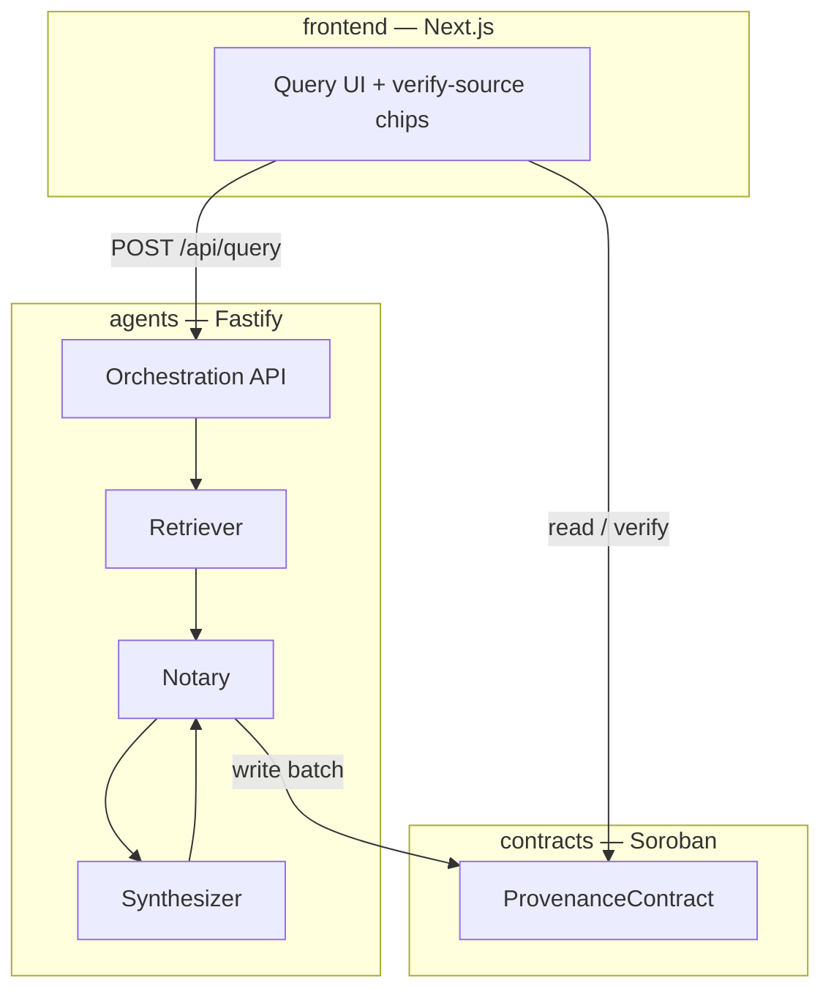

# ProvenanceBot

Verifiable content-sourcing agent on **Stellar/Soroban**. ProvenanceBot retrieves sources for a query, synthesizes a grounded summary, and anchors source + summary hashes on-chain so every citation can be independently verified.

> Scaffolding only — agent business logic and contract record/verify APIs are not implemented yet.

## Problem statement

AI-generated answers rarely prove _where_ claims came from, or that cited material was not altered after the fact. ProvenanceBot closes that gap by:

1. Fetching explicit sources for each query
2. Hashing those sources before synthesis
3. Writing a batch of source hashes + summary hash + timestamps to a Soroban contract
4. Surfacing **verify-source** chips in the UI that resolve to on-chain records

## Architecture



Detailed data flow: [docs/architecture.md](./docs/architecture.md)  
Hash-linking design: [docs/PROVENANCE.md](./docs/PROVENANCE.md)  
Contributing / commit convention: [CONTRIBUTING.md](./CONTRIBUTING.md)

## Monorepo layout

```
/
├── agents/          Node/TypeScript — Retriever, Synthesizer, Notary + API
├── contracts/       Soroban smart contract (Rust)
├── frontend/        Next.js 14 (App Router) + Tailwind
├── docs/            Architecture & provenance design
└── .github/workflows  CI — lint + test
```

Workspaces are linked with **pnpm** (`pnpm-workspace.yaml`): `agents` and `frontend`. The Rust contract lives under `contracts/` and is built with Cargo (not a Node workspace package).

## Prerequisites

- Node.js 20+
- [pnpm](https://pnpm.io) 9 (`npm install -g pnpm@9`)
- Rust + `wasm32v1-none` for contracts (pinned in `contracts/rust-toolchain.toml`)
- Soroban/Stellar CLI (optional until deploy)

```bash
rustup target add wasm32v1-none
```

## Setup

```bash
# From repo root
pnpm install

# Env templates
cp agents/.env.example agents/.env
cp frontend/.env.example frontend/.env.local
```

### Contracts

```bash
cd contracts
cargo check -p provenance
cargo build --release --target wasm32v1-none -p provenance
```

See [contracts/README.md](./contracts/README.md).

### Agents

```bash
pnpm --filter @provenancebot/agents dev
# → http://localhost:3001  (GET /health, POST /api/query)
pnpm --filter @provenancebot/agents test
pnpm --filter @provenancebot/agents lint
```

Required env vars are documented in [`agents/.env.example`](./agents/.env.example) (Soroban RPC URL, network passphrase, contract ID, Sentry DSN, analytics key, etc.).

### Frontend

```bash
pnpm --filter @provenancebot/frontend dev
# → http://localhost:3000
pnpm --filter @provenancebot/frontend lint
pnpm --filter @provenancebot/frontend test
```

Required env vars are documented in [`frontend/.env.example`](./frontend/.env.example) (agents API URL, Soroban public config, WalletConnect, analytics, Sentry).

## Root scripts

| Script              | Description              |
| ------------------- | ------------------------ |
| `pnpm lint`         | Lint all Node workspaces |
| `pnpm test`         | Test all Node workspaces |
| `pnpm format`       | Prettier write           |
| `pnpm format:check` | Prettier check           |
| `pnpm dev:agents`   | Start agents API         |
| `pnpm dev:frontend` | Start Next.js            |

## License

Apache-2.0 (intended; confirm before public release).
