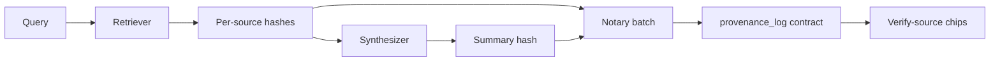

# Provenance Hash-Linking Design

ProvenanceBot anchors **cryptographic commitments** to sourced content on Stellar/Soroban so a reader can verify that a published summary was derived from specific, unmodified sources at a known time.

## Why hash-link?

Storing full articles on-chain is expensive and unnecessary. Instead we store:

- A **content hash** per source (commitment to the retrieved bytes / normalized text)
- A **summary hash** (commitment to the synthesizer output)
- **Timestamps** and a **batch id** binding those hashes together

Anyone with the original source bytes (or a re-fetch that normalizes identically) can recompute the hash and compare it to the on-chain record.

## Hashing model (implemented)

```
source_i_bytes  --normalize-->  source_i_canonical  --SHA-256-->  H(source_i)  → source_hash
uri             --lowercase---->  uri_canonical       --SHA-256-->  H(uri)       → uri_hash
summary_text    --normalize---->  summary_canonical   --SHA-256-->  H(summary)   → summary_hash
query_text      --normalize---->  query_canonical     --SHA-256-->  H(query)     → query_hash
```

Implementation: `agents/src/lib/hash.ts` — whitespace normalization, lowercase, SHA-256 hex.

## On-chain record shape (implemented)

See `contracts/provenance_log` — `ProvenanceEntry`:

```
ProvenanceEntry {
  summary_hash: BytesN<32>,
  query_hash: BytesN<32>,
  sources: Vec<SourceRecord>,   // batched in one submit_provenance tx
  created_at: u64,
  submitter: Address
}
```

Each `SourceRecord` holds `source_hash`, `uri_hash`, `retrieved_at`.

Verification UX:

1. User clicks a **verify-source** chip next to a citation.
2. Frontend loads the on-chain record by `batch_id` / contract storage key.
3. Frontend (or agents API) re-hashes the cited source payload and compares to `source_hashes[i]`.
4. Chip shows **verified** / **mismatch** / **unavailable**.

## Linking summary ↔ sources

The batch is the binding object: the summary hash and source hashes are written in one transaction. That prevents a later attacker from swapping sources under an already-published summary without producing a new on-chain batch (and a new visible record id).



## Off-chain archive

Raw source content is stored in `agents/data/content-archive/` keyed by `source_hash`. This preserves the exact bytes hashed at retrieval time even if the live URL changes or disappears. GET `/api/verify/:sourceHash` returns archived content and flags live URL drift.
