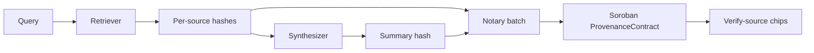

# Provenance Hash-Linking Design

ProvenanceBot anchors **cryptographic commitments** to sourced content on Stellar/Soroban so a reader can verify that a published summary was derived from specific, unmodified sources at a known time.

## Why hash-link?

Storing full articles on-chain is expensive and unnecessary. Instead we store:

- A **content hash** per source (commitment to the retrieved bytes / normalized text)
- A **summary hash** (commitment to the synthesizer output)
- **Timestamps** and a **batch id** binding those hashes together

Anyone with the original source bytes (or a re-fetch that normalizes identically) can recompute the hash and compare it to the on-chain record.

## Hashing model (intended)

```
source_i_bytes  --normalize-->  source_i_canonical  --SHA-256-->  H(source_i)
summary_text    --UTF-8------>  summary_bytes       --SHA-256-->  H(summary)

batch = {
  source_hashes: [H(source_1), ..., H(source_n)],
  summary_hash:  H(summary),
  queried_at:    ISO-8601 / ledger timestamp,
  recorded_at:   ledger close time
}
```

Normalization rules (to be locked before production):

- Stable UTF-8 encoding
- Trim trailing whitespace; collapse insignificant HTML to text
- Include canonical URL + retrieval timestamp in a signed envelope when hashing, so the same body at a different URL does not silently collide with a different citation context

## On-chain record shape (intended)

```
ProvenanceRecord {
  batch_id: BytesN<32>,
  source_hashes: Vec<BytesN<32>>,
  summary_hash: BytesN<32>,
  timestamp: u64,
  submitter: Address
}
```

Verification UX:

1. User clicks a **verify-source** chip next to a citation.
2. Frontend loads the on-chain record by `batch_id` / contract storage key.
3. Frontend (or agents API) re-hashes the cited source payload and compares to `source_hashes[i]`.
4. Chip shows **verified** / **mismatch** / **unavailable**.

## Linking summary ↔ sources

The batch is the binding object: the summary hash and source hashes are written in one transaction. That prevents a later attacker from swapping sources under an already-published summary without producing a new on-chain batch (and a new visible record id).



## What is intentionally not specified yet

- Exact normalize() algorithm and hash domain separation tags
- Whether to use SHA-256 vs. Soroban-native keccak/sha256 helpers exclusively
- Retention of raw source blobs off-chain (IPFS, object storage, etc.)
- Multi-party attestation / threshold notary

Those land with the Notary and contract implementation commits — this file only freezes the **hash-linking** intent for scaffolding.
