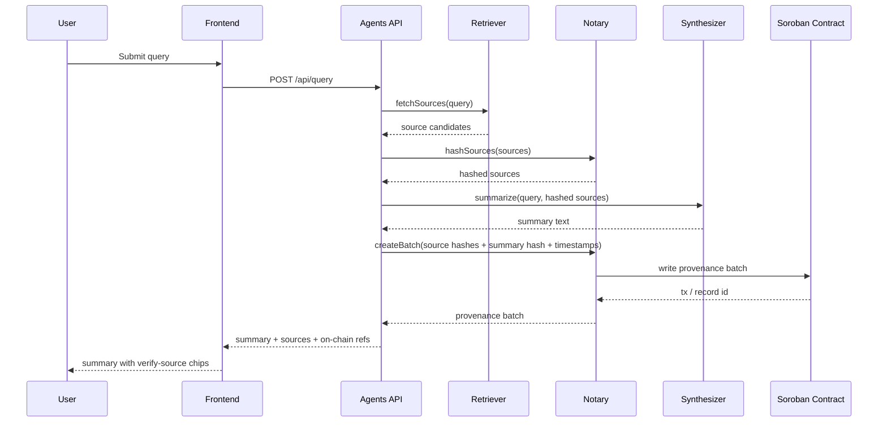

# ProvenanceBot Architecture

This document describes the scaffolding-era data flow for ProvenanceBot — a verifiable content-sourcing agent on Stellar/Soroban. Business logic is not implemented yet; the packages below define the intended seams.

## Packages

| Package      | Role                                                       |
| ------------ | ---------------------------------------------------------- |
| `contracts/` | Soroban registry for batched provenance records            |
| `agents/`    | Retriever, Synthesizer, Notary + Fastify orchestration API |
| `frontend/`  | Next.js UI that renders summaries and verify-source chips  |

## End-to-end data flow

### Step-by-step

1. **Query** — The frontend posts a natural-language query to the agents orchestration API (`POST /api/query`).
2. **Retriever** — Fetches candidate sources (URLs, titles, excerpts) relevant to the query.
3. **Notary (per source)** — Computes a content hash for each source so later verification can detect tampering.
4. **Synthesizer** — Produces a grounded summary from the hashed source set (not from unhashed raw blobs alone).
5. **Notary (batch)** — Bundles source hashes + summary hash + timestamps into a provenance batch and writes it to the Soroban contract.
6. **Frontend** — Renders the summary and **verify-source** chips. Each chip links a cited source to its on-chain hash record so users can confirm integrity.

## API surface (scaffold)

| Method | Path         | Purpose                                              |
| ------ | ------------ | ---------------------------------------------------- |
| `GET`  | `/health`    | Liveness                                             |
| `POST` | `/api/query` | Run the orchestration pipeline (stub response today) |

## On-chain seam

The `provenance` contract will eventually expose record/verify entrypoints. Today it only exposes `ping` as a compile/test placeholder. See [PROVENANCE.md](./PROVENANCE.md) for the hash-linking design.

## Trust boundaries

- **Agents** hold the signing key that submits batches to Soroban (server-side secret).
- **Frontend** is read-oriented for verification: RPC URL, network passphrase, and contract ID are public; it does not need the notary secret key.
- **Hashes**, not full source bodies, are what get anchored on-chain — see PROVENANCE.md.
