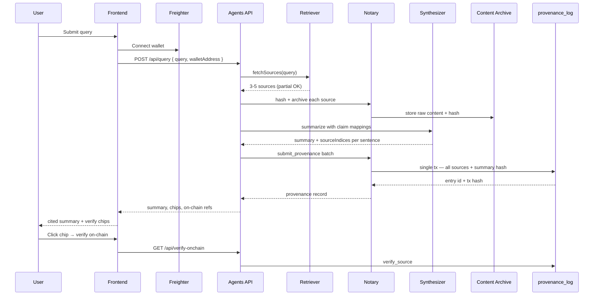

# ProvenanceBot Architecture

End-to-end data flow for the verifiable content-sourcing agent on Stellar/Soroban.

## Packages

| Package      | Role                                                       |
| ------------ | ---------------------------------------------------------- |
| `contracts/` | `provenance_log` Soroban contract — batched provenance storage |
| `agents/`    | Retriever, Synthesizer, Notary + Fastify orchestration API |
| `frontend/`  | Next.js UI — summaries, citation chips, wallet connect   |

## End-to-end data flow

## API surface

| Method | Path | Purpose |
| ------ | ---- | ------- |
| `GET` | `/health` | Liveness + contract status |
| `GET` | `/status` | Network, contract ID, Soroban config |
| `POST` | `/api/query` | Full pipeline (wallet required) |
| `GET` | `/api/verify/:sourceHash` | Archived content + live URL drift |
| `GET` | `/api/verify-onchain` | `verify_source` simulation |
| `POST` | `/api/feedback` | Pilot feedback |
| `GET` | `/admin/interactions` | Wallet interaction log |
| `GET` | `/admin/export` | Pilot data export |

## On-chain contract

`provenance_log` exposes:

- `submit_provenance` — batched write (all sources in one tx)
- `get_provenance` / `get_provenance_by_summary_hash`
- `verify_source` — boolean check for citation chips
- `bump_ttl` — archival safety

Contract ID (testnet): see `contracts/testnet-contract-id.txt`.

## Trust boundaries

- **Agents** sign Soroban transactions with `STELLAR_SECRET_KEY`; wallet address is logged for attribution.
- **Content archive** preserves fetched bytes off-chain; hashes anchor on-chain.
- **Frontend** verifies via public RPC — no secret keys in browser.

See [PROVENANCE.md](./PROVENANCE.md) for hash-linking details.
